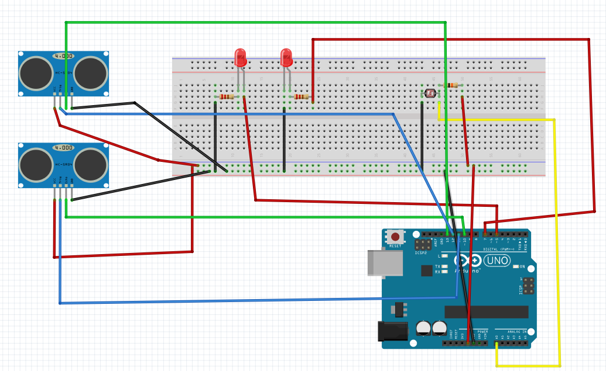

# smartStreetLight
In this smart street light system we used two ultra sonic sensors for detecting presence.
We used a LDR if we sense any light then system will not work for saving energy.
As soon as light goes out our sensors stars working and if we found someones presence then LED(street light) will turn on else remain off.

